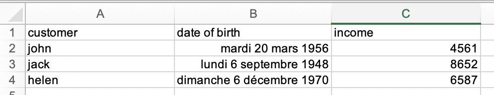

= Bonita connector read excel

This connector can read an Excel file.

The first line will be used as output field name.

Given this sample :

== Input parameters

|===
|Parameter |Description | Type

|excelDocument | input file |`org.bonitasoft.engine.bpm.document.Document`
|===

== Output parameter structure

Result is a `java.util.List`.

[source,groovy]
----
[excelData:
    [
        [customer: "john", "date of birth": "Tue Mar 20 00:00:00 CET 1956", income: 4561.0],
        [customer: "jack", "date of birth": "Mon Sep 06 00:00:00 CET 1948", income: 8652.0],
        [customer: "helen", "date of birth": "Sun Dec 06 00:00:00 CET 1970", income: 6587.0]
    ]
]
----

== Use result in connector output operation

[source,groovy]
----

excelResult.each { excelLine ->
    def customer = excelLine.customer
    def dateOfBirth = excelLine.'date of birth'<1>
    def income = excelLine.income

    // add your business logic
}

----
<1> Be aware of time zone issue since it's a `java.util.Date`

== Build
To build the connector project, type the following command at the root of the project :

[source]
----
./mvnw clean install
----
The built archive can be found in here `target/[artifact id]-[artifact version].zip` after the build.